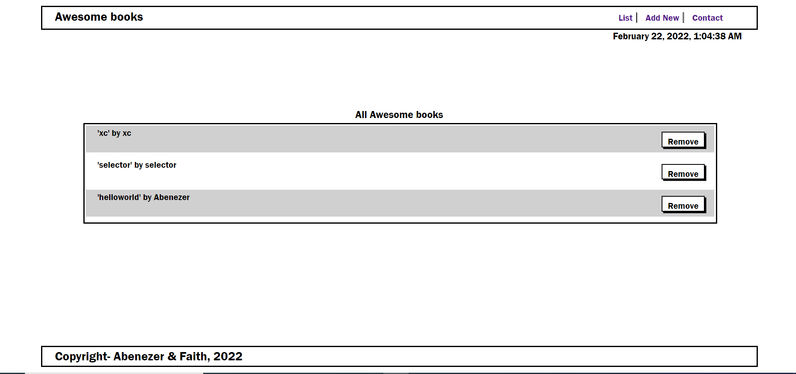

# Awesome-books

This is a pair programming project that allows users to add and remove books from a list using javascript objects and arrays

The goal of the project is to build the application using Vanilla JavaScript and ES6 Modules.. click [here] (https://usorfaitheloho.github.io/Awesome-booksES6/) to see deployed live version

## Features implemented so far
- Add book feature
- Remove book feature
- Saving current state of booklist to local storage 

## Built With

- HTML5, Javascript
- CSS3
- Linters

To get a local copy up and running follow these simple example steps.

### Prerequisites
- Have a good knowledge on javascript objects
- Have VSCode or other text editor installed. [Link to download VSCode](https://code.visualstudio.com/download)
- Install node package. [Link to download node](https://nodejs.org/en/download/)
- Have git installed.[Link to download git](https://git-scm.com/downloads)
- Create a github repository.

### Setup
- git clone https://github.com/usorfaitheloho/Awesome-booksES6.git
- cd Awesome-booksES6/

## Authors

👤 **Faith Eloho usor**

- GitHub: [@githubhandle](https://github.com/usorfaitheloho)

